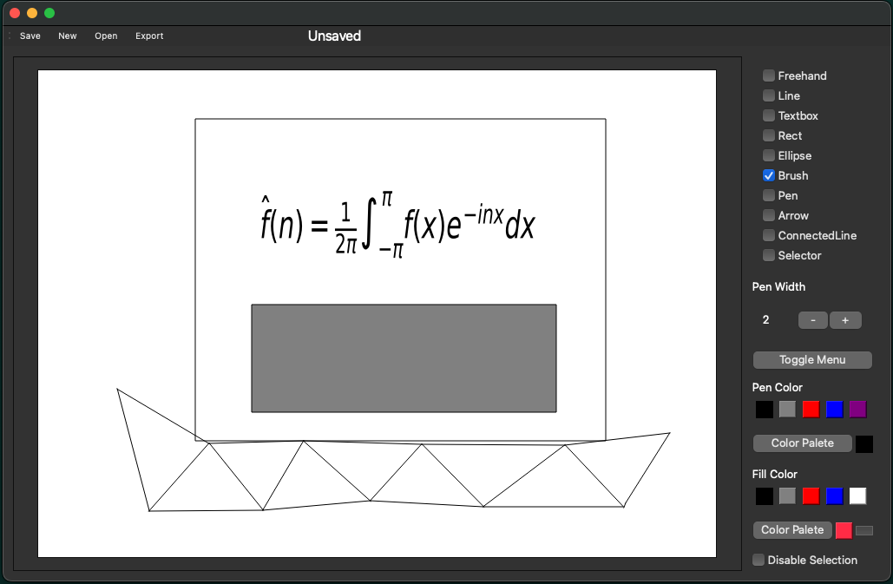

# ⚠️  ** Under Development ** ⚠️
# Scalable Vector Graphics Editor

A minimalistic vector graphics editor designed for creating svg images with LaTeX support.

## Usage
Flags include
- '-f  --file': select an svg file to edit

## Tools
* `Selector`: Used for selecting graphics items
* `Textbox`: In addition to functioning as a standard text box, LaTeX may be wrote, and compiled using the [shortcut](#shortcuts) `ctrl-c`.
 The LaTeX inside of the text box must be surrounded by single dollar signs, e.g `$\lambda$`. LaTeX is compiled using matplotlib.
* `Line`: Used to draw a straight line
* `Pen`: Pen is set with a pen width and color, when a graphics item is clicked using this tool, its border is changed to the pens width
and color.
* `Brush`: Fills the background of a graphics item. Note that the rectangular gray button under fill color is the transparent option.
* `Arrow`: Draws an arrow. (Currently broken)
* `ConnectedLine`: 

## Shortcuts
* `ctrl-c`: compiles latex inside of text boxes.
* `shift-l`: select line tool
* `shift-t`: text box tool
* `shift-r`: rectangle tool
* `shift-b`: brush tool
* `shift-p`: pen tool
* `shift-s`: selector tool
* `shift-n`: cycle through elements under cursor
* `shift-v`: paste item
* `shift-c`: copy item

