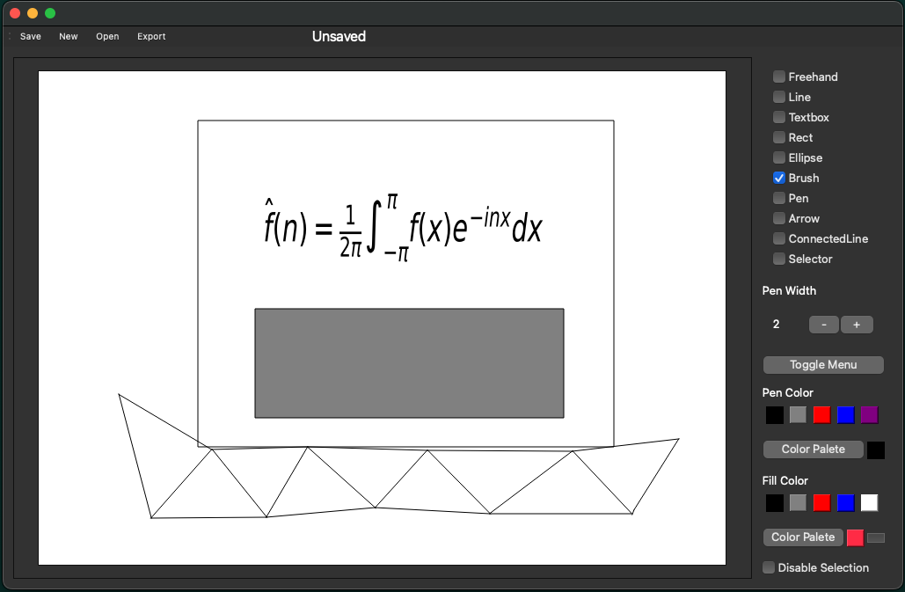

# Vector Graphics Editor

A minimalistic vector graphics editor designed for creating svg images containing LaTex.

## Tools
* `Selector`: Used for selecting graphics items
* `Textbox`: In addition to functioning as a standard text box, LaTex may be wrote, and compiled using the [shortcut](#shortcuts) `ctrl-c`.
 The LaTex inside of the text box must be surrounded by single dollar signs, e.g `$\lambda$`. LaTex is compiled using matplotlib.
* `Line`: Used to draw a straight line
* `Pen`: Pen is set with a pen width and color, when a graphics item is clicked using this tool, its border is changed to the pens width
and color.
* `Brush`: Fills the background of a graphics item. Note that the rectangular gray button under fill color is the transparent option.
* `Arrow`: Draws an arrow. (Currently broken)
* `ConnectedLine`: TODO

## Shortcuts
* `ctrl-c`: compiles latex inside of text boxes.
* `shift-l`: select line tool
* `shift-t`: text box tool
* `shift-r`: rectangle tool
* `shift-b`: brush tool
* `shift-p`: pen tool
* `shift-s`: selector tool
* `shift-n`: cycle through elements under cursor
* `shift-v`: paste item
* `shift-c`: copy item

# Configuration
In order to start the editor you must run `python -m main_gui.py`. Flags include
- '-f  --file': select an svg file to edit

For convenience there is a `vector_graphics.sh` file that will run the project. By
adding 
`alias "{command_name_of_your_choice}="{path_to_project}/./vector_graphics.sh"`
to your shell profile (.zprofile, .bashrc, ect) you can open the editor with a
command. Note that you may need to run `chmod +x
{path_to_project}/vector_graphics.sh` before this will work. 
This should work on macOS, however `vector_graphics.sh` needs to be adjusted for
other operating systems as paths have different formats.
